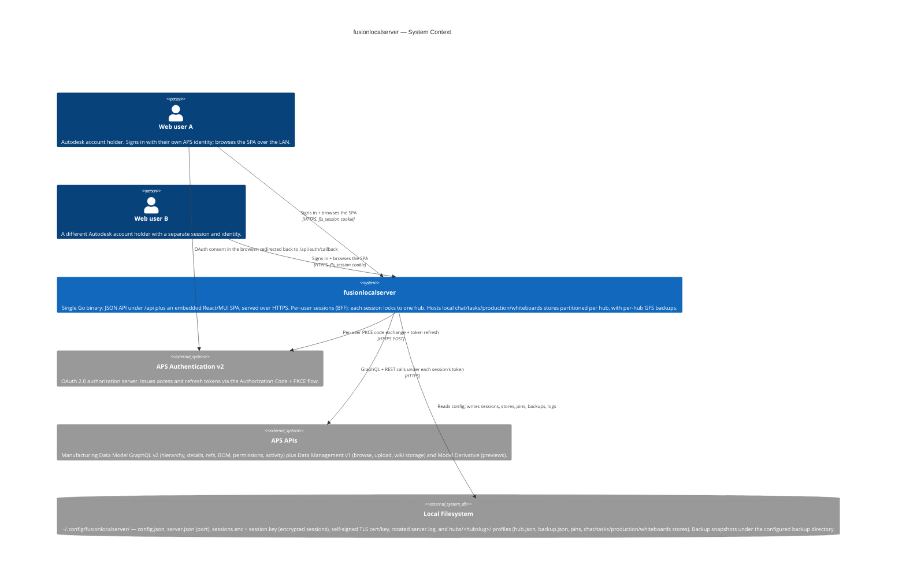
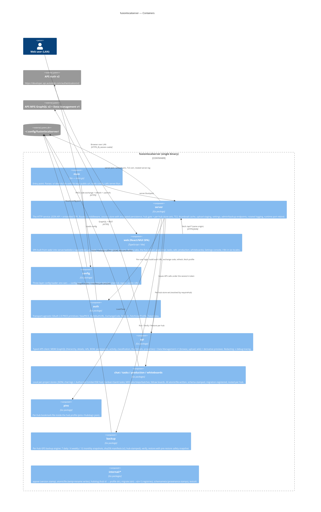
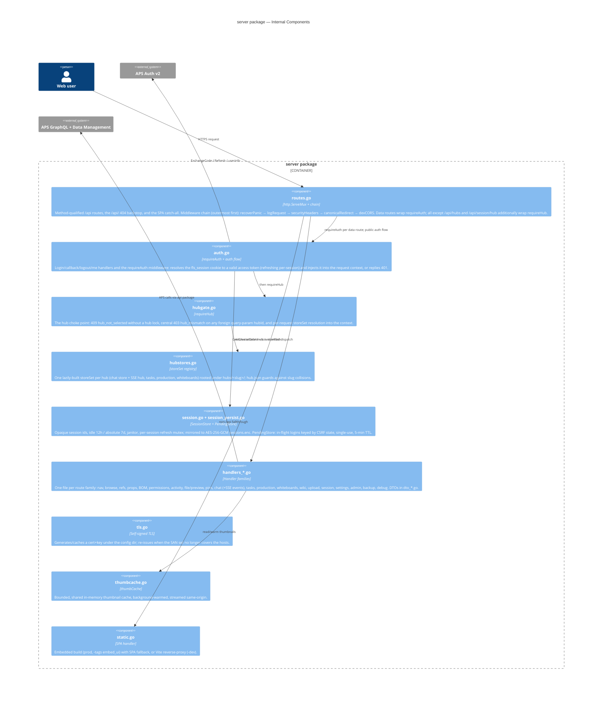
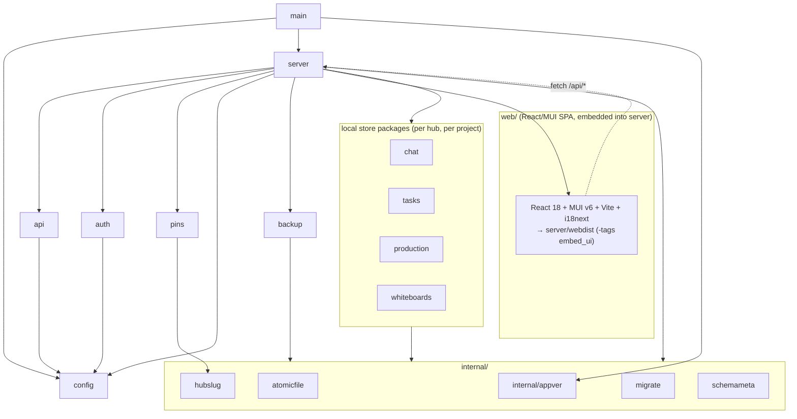
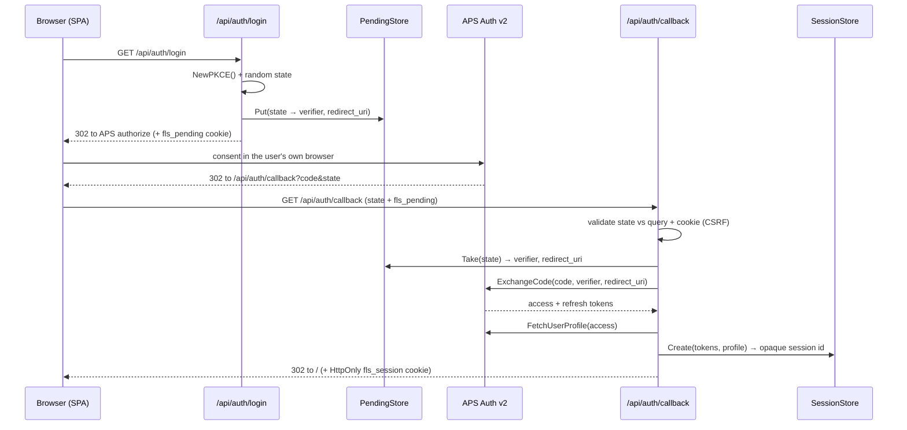
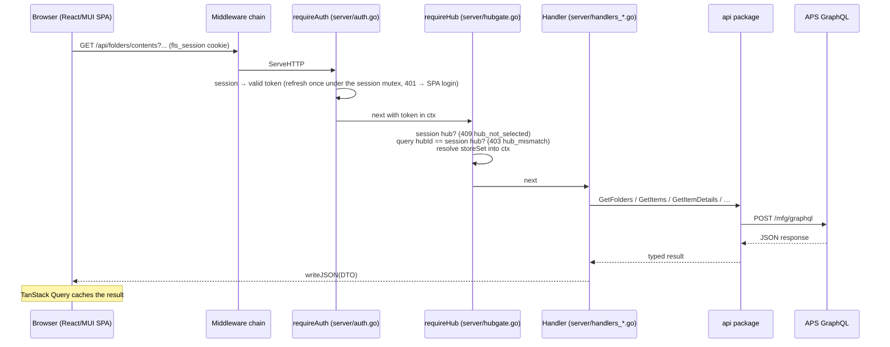
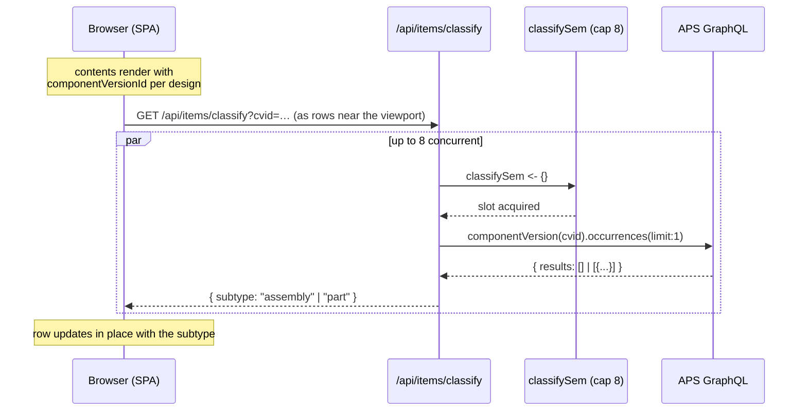

# Architecture

fusionlocalserver is a single-binary Go application that serves Autodesk Platform Services (APS) Fusion Team data to a web browser. The binary always runs **one dedicated HTTP service** (package `server/`): a JSON API under `/api/*` plus an embedded React/MUI single-page web UI built from `web/`.

Authentication is **per user (Backend-For-Frontend)**: each browser user signs in with their own Autodesk account, the server holds that user's APS tokens in a session store, and proxies their data calls under their own identity. The browser only ever holds an opaque `HttpOnly` session cookie — APS access and refresh tokens never reach JavaScript. Sessions survive a process restart: the store is mirrored to an AES-256-GCM-encrypted file (`sessions.enc`, key in `session.key`), so a restart does not log anyone out.

Beyond browsing the APS hierarchy (hubs → projects → folders → designs, with details, history, references, BOM, permissions, and activity), the server hosts **five project apps** — Chat, Tasks, Wiki, Production, and Whiteboards — four of which persist their data in **local per-project stores** (`chat/`, `tasks/`, `production/`, `whiteboards/`; the wiki stores its pages in APS itself). All local data is partitioned per hub (see [Hub Isolation](#hub-isolation)) and covered by a per-hub GFS backup engine (`backup/`).

The HTTP service sits on UI-agnostic layers — `api/` (APS GraphQL + Data Management client), `auth/` (transport-agnostic OAuth PKCE primitives), `config/`, `pins/`, the four store packages, `backup/`, and the `internal/` helpers.

> The Go module is nearly standard-library-only. It has exactly two third-party dependencies (`go.sum` exists): `golang.org/x/sync` (singleflight, used by the chat authorizer and the drawing-preview cache) and `gopkg.in/natefinch/lumberjack.v2` (log rotation). The `go` directive is `go 1.25.0`. The `web/` SPA's npm dependencies (React 18, MUI v6, TanStack Query, i18next, tldraw) are bundled into `server/webdist` and embedded into the binary at build time under `-tags embed_ui`.

---

## Hub Isolation

**Hubs are IP boundaries between clients.** A consultancy serving two customers from one server must never let one customer's local data (chat, tasks, production plans, whiteboards, pins, backups) leak into the other's view. This is a structural invariant, not a filter:

- Every local store roots under a per-hub profile directory `hubs/<hubslug>/` (`hub.json` identity guard, `backup.json`, `chat/`, `tasks/`, `production/`, `whiteboards/`, `pins-<hubslug>.json`).
- The session **locks to one hub** (`POST /api/session/hub`). The SPA runs behind a hub gate after login; switching hubs is a full teardown + reload.
- The `requireHub` middleware (`server/hubgate.go`) wraps **every data route** after `requireAuth`: no selected hub → 409 `hub_not_selected`; any query-param `hubId` that differs from the session's hub → 403 `hub_mismatch` (body-carried hub ids are checked by their handlers via the same helper).
- `requireHub` resolves the session's **store-set** (`server/hubstores.go`) once per request and injects it into the request context. Handlers reach local stores *only* through `storesFromCtx` — there is no code path from one hub's request to another hub's files. Store-sets are built lazily, at most once per hub, and each carries its own chat SSE fan-out so realtime events never cross hubs.

Pre-isolation on-disk layouts are **unsupported** — the one-time relocation migration was retired after the only deployed server migrated. Full design and threat notes: [`docs/hubs/STATUS.md`](hubs/STATUS.md).

---

## System Context



The browser holds only the opaque `fls_session` cookie. The OAuth consent happens in the user's own browser (a top-level redirect to Autodesk and back to `/api/auth/callback`); there is no host-side browser launch and no loopback callback server.

---

## Container Diagram

`main.go` parses six flags (`-v`, `-dev`, `-tls`, `-tls-cert`, `-tls-key`, `-public-url`), loads config, stamps the app version into `internal/appver`, and calls `server.Run`. There is no mode switch — the binary always runs the HTTP service.



### The server

- **Bind address + TLS.** Binds `0.0.0.0:8080` by default, so the web UI is reachable from other machines on the LAN. `-tls` is the standard posture (`make run` passes it): the server serves HTTPS and marks the `fls_session` cookie `Secure`. Without `-tls-cert`/`-tls-key` a self-signed certificate is auto-generated and cached under the config directory (`server/tls.go`), with SANs for the local hostname/IPs plus the `-public-url` host; browsers warn once, but the wire is encrypted. Startup logs the reachable URLs.
- **Canonical public URL.** `-public-url` (or the build-time `config.DefaultPublicURL`) fixes the external base URL: the OAuth `redirect_uri` is built from it, and `canonicalRedirect` middleware bounces requests that arrive via any other host, so only one callback needs registering on the APS app.
- **Sessions persist.** `SessionStore` (opaque `crypto/rand` ids, idle 12 h / absolute 7 d TTLs, janitor, per-session refresh mutex) is mirrored to `sessions.enc`, sealed with AES-256-GCM under a locally generated 32-byte `session.key` (`server/session_persist.go`). A restart or a port rebind keeps everyone signed in.
- **Runtime-configurable port.** Outside `-dev` mode the listen port is persisted in `server.json`; `POST /api/settings/port` validates, saves, and rebinds the listener in-process without a restart. The same rebind flow restarts the server after a backup restore.
- **Embedded SPA vs. stub.** The React/MUI app is embedded only when built with `-tags embed_ui` (`server/static_embed.go`); a plain `go build` compiles `server/static_stub.go`, a "not built yet" shell. In `-dev` mode the static handler reverse-proxies non-`/api` requests to the Vite dev server for HMR.
- **Thumbnail cache + image proxy.** A bounded, shared in-memory cache (`thumbCache`) holds thumbnail status/URLs and PNG bytes keyed by component-version id, warmed in the background off the per-row classify probe; `/api/items/thumbnail/image` streams bytes same-origin so browsers never fetch the cross-origin APS signed URL directly.
- **Upload staging.** `server/uploads.go` tracks multi-step APS uploads (storage → signed S3 → item/version) used by the wiki and production document flows.
- **Admin surface.** `/api/admin/*` powers the Settings console: server status/uptime, log tail, disk usage, per-project data deletion, and the backup endpoints (list, run, verify, restore, per-hub config).

### Runtime: CLI, logging, and filesystem

- **CLI flags.** `-v` (debug logging + redacted GraphQL tracing), `-dev` (Vite reverse proxy, pinned port), `-tls` (HTTPS; self-signed cert auto-generated when `-tls-cert`/`-tls-key` are absent), `-tls-cert`/`-tls-key` (bring-your-own PEM pair), `-public-url` (canonical external base URL). The binary always serves — the listen port is changed from Settings → Connection, not a flag.
- **Logging.** A single `log/slog` text logger (`server/logging.go`) writes to `io.MultiWriter(os.Stdout, server.log)`. The log file is **rotated by lumberjack**: 10 MB per file, 3 compressed generations kept. Default level is info; `-v` raises it to debug, which adds the per-request line and routes the `api` package's redacted GraphQL request/response traces to the same sinks.
- **Filesystem.** `~/.config/fusionlocalserver/` holds `config.json` (client id + region), `server.json` (listen port), `sessions.enc` + `session.key` (encrypted session mirror), the cached self-signed TLS cert/key, rotated `server.log*`, and one `hubs/<hubslug>/` profile per hub — `hub.json` (identity guard), `backup.json` (per-hub backup config), `pins-<hubslug>.json`, and the `chat/`, `tasks/`, `production/`, `whiteboards/` store directories.

---

## Component Diagram — `server` package

The `server` package is the only front end. Its internal pieces are the route table + middleware chain, the auth and hub gates, the per-hub store-sets, the session subsystem with encrypted persistence, the handler families, and the embedded-SPA static handler.



---

## Package Dependency Graph

`main` calls `server`, which depends on the shared `api` / `auth` / `config` / `pins` / `backup` layers, the four store packages, and the `internal/` helpers.



The module's two third-party Go dependencies are `golang.org/x/sync` (singleflight) and `gopkg.in/natefinch/lumberjack.v2` (log rotation); everything else is standard library. The `go` directive is `go 1.25.0`. The `web/` SPA's npm dependencies are bundled into `server/webdist` and embedded under `-tags embed_ui`.

---

## Local Data Stores

Four features keep data that is *ours*, not APS's: chat, tasks, production, and whiteboards. They all share one posture:

- **One JSON/JSONL file per project** under the hub profile (`hubs/<hubslug>/<store>/`); whiteboards additionally split each board's tldraw document into its own `doc-<id>.json` because a document is megabytes and rewritten on every autosave.
- **Atomic writes** via `internal/atomicfile` (temp file + rename — readers see old bytes or new bytes, never a torn file), a **per-project mutex**, and a `.bak` sidecar on corruption.
- **Versioned envelopes** with a **schema provenance stamp** (`internal/schemameta` — createdAt/createdByVersion/updatedAt/updatedByVersion), a **future-version guard** (never rewrite what we don't understand), and per-store **migration registries** (`internal/migrate` — v(n)→v(n+1) steps that snapshot pre-migration bytes to `<file>.vN.bak`).
- **Authorization delegated to `chat.Authorizer`** — APS project role mapped to capabilities (singleflight-deduplicated roster fetches), not a parallel permission system — plus a shared rate `Limiter`.

Per store: **chat** (`docs/chat/STATUS.md`) is append-only JSONL channel logs with a per-hub SSE fan-out (`/api/chat/events`); **tasks** is `tasks.json` per project — Kanban plus a Gantt schedule (start/end dates, progress, dependsOn, milestone, stage); **production** (`docs/production/STATUS.md`) is `production.json` per project — jobs as step DAGs of work steps and colour-coded branching decisions, carrying version-pinned documents, plus batches that deep-freeze the plan at run time; **whiteboards** (`docs/whiteboards/STATUS.md`) stores tldraw board metadata + documents.

### Backups

`backup/` implements a per-hub **GFS** (grandfather-father-son) engine: **7 daily / 4 weekly / 12 monthly** snapshots, promotion by directory copy (pruning a daily can never hollow out a weekly/monthly). Every snapshot carries a `manifest.json` (ManifestVersion **2**) with per-file sha256 hashes, schema versions, and the **hub identity** (hub id + slug). *Verify* re-hashes, re-parses, and version-checks a snapshot; *restore* takes a pre-restore safety snapshot, secret-merges `config.json`, refuses foreign-hub / pre-isolation (v1) / path-escaping manifests, and restarts the server via the port-rebind flow. Sources are allow-listed: `sessions.enc`, `session.key`, TLS keys, and logs are unreachable by construction, and `config.json` is captured with `client_secret` blanked. Config lives per hub in `hubs/<slug>/backup.json`; the Settings → Backups tool drives it.

---

## Data Flow

Every `/api/*` request runs through the middleware chain (`recoverPanic → logRequest → securityHeaders → canonicalRedirect → devCORS`) and a handler; data routes additionally pass through `requireAuth` (session → APS token) and, except for `/api/hubs` and `POST /api/session/hub`, through `requireHub` (hub lock → storeSet).

### Login (per-user OAuth Authorization Code + PKCE)



The `redirect_uri` is built from the canonical public URL (`-public-url` or the baked-in default), so exactly one callback is registered on the APS app. After login the SPA shows the **hub gate**: the user picks a hub (a remembered hub auto-relocks) and `POST /api/session/hub` locks the session to it. The browser receives only the opaque `fls_session` cookie; the APS tokens stay in the `SessionStore` (mirrored encrypted to disk).

### Data request to JSON



A 401 from `requireAuth` is what the SPA turns into a login redirect; a 409 `hub_not_selected` tears down to the hub gate. Server errors carry a stable `code` token that the SPA maps to a localized message (`web/src/i18n/apiError.ts`). Unmatched `/api/*` paths hit the `/api/` backstop and return a JSON 404; all other paths fall through to the SPA shell so client-side deep links resolve.

### Async assembly-vs-part classification

After a folder/project's contents load, each design is enriched with an "assembly" / "part" subtype derived from whether its `tipRootComponentVersion` has any sub-component occurrences. The probe (`api.ClassifyAssembly`, exposed as `GET /api/items/classify`) is capped at 8 concurrent calls by a package-level semaphore in `api/classify.go`. The items queries pull `tipRootComponentVersion.id` inline for designs, so the classifier can probe occurrences without a second round-trip. The SPA dispatches classify requests as rows near the viewport (`useInView`) and merges each result into the rendered list as it lands.



---

## Web UI

The SPA (React 18 + Vite + TypeScript + MUI v6 + TanStack Query) is a single stage: hub gate → browser columns → project panel. The five project apps live one folder each (`web/src/chat/`, `tasks/`, `wiki/`, `production/`, `whiteboards/`) and mount as tabs in `ProjectPanel.tsx` under the contract `({ active }: { active?: boolean })` — every tab stays mounted and gates its fetching on `active`. Cross-cutting pieces:

- **i18n** — i18next with six locales (`en` source of truth + `de`/`fr`/`es`/`it`/`pt`), semantic keys only, enum tokens via `src/i18n/enums.ts`, server error codes mapped by `src/i18n/apiError.ts`, and an eslint ratchet forbidding literal strings. Grapheme-safe text helpers live in `src/fmt/graphemes.ts`. See [`docs/i18n/STATUS.md`](i18n/STATUS.md).
- **Settings console** — `components/settings/`, a master-detail dialog: Appearance (theme, language, custom colors — per hub), Connection (port, region, hub switch), Uptime, Logs, Backups (run/verify/restore/config), Data (disk usage, per-project deletion).
- **Visualizations are hand-drawn inline SVG** (`RelationGraph`, `history/HistoryTimeline`, `ActivityHeatmap`, the production flow canvas); the only chart library is one recharts donut. The only CSS file is `whiteboards/whiteboard.css`, which reskins tldraw — everything else is MUI `sx`.
- **Shared inputs** — `components/DateField.tsx` is the app's date picker: a read-only field plus a hand-drawn month-grid popover, Monday-first in every locale so it agrees with the Gantt's calendar bands. There is no date library; the whole-day helpers live in `src/fmt/dates.ts` (re-exported by `tasks/gantt/ganttMath.ts`, their oldest caller).
- **Hub-scoped client state** — theme mode, colors, and remembered hub key off the hub (`state/hubKeys.ts`); switching hubs runs a full teardown + reload (`state/teardown.ts`).

---

## Performance Optimizations

A few targeted optimizations keep navigation snappy on large hubs:

- **Thumbnail cache + image proxy** — the shared in-memory `thumbCache` (bounded, with TTL) holds thumbnail status/URL and PNG bytes keyed by component-version id, warmed in the background off the classify probe. A second viewer of the same design is served from cache.
- **Viewport-gated per-row calls** — APS calls are quota'd (a per-minute cost budget answered with 429s), so nothing fans out per row eagerly: per-item probes wait for the row to near the viewport (`components/useInView.ts`), and per-container work is capped with a visible "Load all".
- **Inline classifier input** — the hierarchy items queries pull `tipRootComponentVersion.id` inline for designs, so the assembly/part classifier needs one extra call per row rather than a details round-trip first.
- **Parallel project-contents fetch** — the project-contents handler issues `foldersByProject` and `itemsByProject` concurrently; wall-clock latency drops to roughly the slower of the two queries.
- **Bounded-parallelism classifier** — at most 8 occurrence probes in flight against the gateway at once (`classifySem`).
- **Client-side caching** — TanStack Query memoizes per-item details and relationship queries; realtime/per-user keys (`chat*`, `task*`, `prod*`) are excluded from localStorage persistence.

---

## Resilience — APS gateway flakiness

The APS Manufacturing Data Model GraphQL gateway (`/mfg/graphql`) intermittently returns `code:NOT_FOUND, errorType:UNKNOWN` for hub URNs it just successfully enumerated. `gqlQuery` (in `api/client.go`) wraps a single-shot `gqlQueryOnce` in a 3-attempt retry loop with backoffs `0 → 500 ms → 1.5 s`. Retry triggers are narrow:

- Transport errors and HTTP `408` / `5xx` (network / transient gateway).
- Path-less GraphQL `errors[]` carrying `extensions.errorType: "UNKNOWN"` (the gateway's marker for intermittent upstream faults).

HTTP **429 is deliberately not retried** — it signals the per-minute, cost-based query-point quota, which a retry cannot replenish; the error (with `Retry-After` when present) surfaces to the handler and the UI. HTTP `401` and concrete-typed GraphQL errors (`VALIDATION`, `BAD_USER_INPUT`, …) are surfaced immediately. Total worst-case added latency is ~2 s. See [`docs/api.md`](api.md#error-handling-and-retry) for the decision tree.

---

## Test Strategy

A three-layer test pyramid lives alongside the code it exercises. The full strategy, layer-by-layer details, naming conventions, and instructions for adding new tests live in [`docs/testing.md`](testing.md).

| Layer | What it covers |
|-------|----------------|
| **L1 — Pure unit** | Config parsing, OAuth/PKCE helpers, GraphQL response decode, session/pending stores, thumbnail cache, store CRUD + migrations, backup GFS/manifest logic, hub slugs (no network) |
| **L2 — HTTP integration** | OAuth code exchange/refresh and `gqlQuery` against `httptest.Server` fakes (`internal/testutil/graphql.go`) |
| **L3 — Server flow** | `requireAuth` + `requireHub` + handlers exercised end-to-end through `server.routes()` with stubbed auth/api round-trips, including hub-isolation and security suites (`hub_isolation_test.go`, `*_security_test.go`, fuzz tests) |

CI (`.github/workflows/test.yml`) runs `go vet` + `go test -race -count=1 -coverprofile` on every pull request and push to `main`; locally `make check` does the same.

---

## File Layout

```
fusionlocalserver/
├── main.go                  Entry point. Parses -v/-dev/-tls/-tls-cert/-tls-key/-public-url,
│                            loads config, sets appver, calls server.Run.
│
├── config/
│   └── config.go            Three-layer Load(): APS_* env vars → config.json → ldflags-injected
│                            DefaultClientID / DefaultRegion / DefaultPublicURL (baked from the
│                            git-ignored .aps-client-id / .aps-region / .aps-public-url files)
│
├── auth/                    Transport-agnostic OAuth PKCE primitives — no browser, no listener
│   ├── oauth.go             NewPKCE(), BuildAuthURL(), ExchangeCode(), Refresh()
│   ├── userinfo.go          FetchUserProfile() — OIDC userinfo
│   └── tokens.go            TokenData, TokenData.Valid()
│
├── api/                     APS clients (MDM GraphQL v2 + Data Management v1 + derivatives)
│   ├── client.go            gqlQuery() retry loop, NavItem, SetRegion()
│   ├── queries.go           Hierarchy queries + allPages() pagination
│   ├── details.go           GetItemDetails, version history (incl. milestones)
│   ├── refs.go              Uses / Where-used / Drawings cross-reference queries
│   ├── bom.go               BOM extraction
│   ├── permissions.go       Project/folder member + role queries
│   ├── activity_graphql.go / activity_report.go   Design activity report
│   ├── browse.go / datamanagement.go              Data Management v1 listings
│   ├── upload.go / files.go / wiki.go / wiki_publish.go   Upload + wiki storage flows
│   ├── classify.go          ClassifyAssembly + classifySem (cap 8)
│   ├── thumbnail.go / derivative.go / properties.go / customprops.go / locate.go
│   ├── production_snapshot.go   Server-side version resolution for production pins
│   └── debug.go             Redacting raw GraphQL tracing under -v
│
├── chat/                    Local chat store: append-only JSONL channel logs, cursors,
│                            snapshot/migration, per-hub SSE Hub, shared Authorizer
│                            (APS role → capability, singleflight) + rate Limiter
├── tasks/                   tasks.json per project — Kanban + Gantt schedule
├── production/              production.json per project — jobs, step DAGs, batches
├── whiteboards/             whiteboards.json metadata + doc-<id>.json per tldraw board
│
├── pins/
│   └── pins.go              Per-hub bookmarks (hubs/<hubslug>/pins-<hubslug>.json)
│
├── backup/                  Per-hub GFS backup engine
│   ├── engine.go            Run(): snapshot + sha256 manifest (ManifestVersion 2, hub-stamped)
│   ├── gfs.go               7 daily / 4 weekly / 12 monthly retention + promotion
│   ├── sources.go           Allow-listed sources (secrets unreachable by construction)
│   ├── verify.go            Re-hash + parse + schema-version check
│   ├── restore.go           Pre-restore safety snapshot, secret-merge, foreign-hub refusal
│   ├── manifest.go          Manifest read + future-version guard
│   └── schedule.go          Daily scheduling
│
├── internal/
│   ├── appver/              Running binary's version for schema stamps
│   ├── atomicfile/          The one write path: temp file + rename (no torn files)
│   ├── hubslug/             Hub id → filesystem-safe slug + profile dir resolution
│   ├── migrate/             Shared v(n)→v(n+1) migration framework (.vN.bak snapshots)
│   ├── schemameta/          Provenance stamp (createdAt/By, updatedAt/By) on every store file
│   └── testutil/            In-process APS GraphQL fake (httptest.Server)
│
├── server/                  The HTTP service: JSON API + embedded SPA
│   ├── server.go            Run(), Options, listener (re)bind loop, graceful drain
│   ├── routes.go            ServeMux + middleware chain (recover → log → securityHeaders →
│   │                        canonicalRedirect → devCORS); prot()/protHub() wrappers
│   ├── auth.go              Auth handlers + requireAuth middleware
│   ├── hubgate.go           requireHub: 409 hub_not_selected / 403 hub_mismatch,
│   │                        per-request storeSet resolution
│   ├── hubstores.go         One lazily-built storeSet per hub under hubs/<slug>/
│   ├── session.go           SessionStore (idle 12h / absolute 7d) + PendingStore (5 min)
│   ├── session_persist.go   AES-256-GCM sessions.enc + session.key mirror
│   ├── tls.go               Self-signed cert generation/caching, SAN coverage checks
│   ├── handlers_*.go        One file per route family: nav, browse, refs, props, pins,
│   │                        activity, chat (+ handlers_chat_events.go SSE), tasks,
│   │                        production, whiteboards, wiki, file, drawingpreview, upload,
│   │                        session, settings, admin, admin_data, backup, debug
│   ├── dto*.go              JSON DTOs per family (dto.go, dto_chat.go, dto_tasks.go, …)
│   ├── uploads.go           Multi-step APS upload staging
│   ├── settings.go          server.json (listen port) load/save
│   ├── thumbcache.go        Bounded in-memory thumbnail cache
│   ├── logging.go           slog → stdout + lumberjack-rotated server.log (10 MB × 3, gzip)
│   ├── middleware.go        recoverPanic / logRequest / securityHeaders /
│   │                        canonicalRedirect / devCORS
│   ├── respond.go           writeJSON / writeError / writeErrorCode helpers
│   ├── static.go / static_embed.go / static_stub.go   SPA handler (embed_ui tag)
│   └── webdist/             Vite build output (gitignored, embedded at compile time)
│
├── web/                     React/MUI SPA (Vite, TypeScript)
│   ├── src/
│   │   ├── api/             Typed request() wrapper + react-query hooks
│   │   ├── components/      Browser columns, details tabs, graphs (RelationGraph,
│   │   │                    ActivityHeatmap), HubGate, RefCard, viewers
│   │   │   └── history/     Version-history day timeline (HistoryTimeline, DayRow,
│   │   │                    ThreadOverlay, historyLayout)
│   │   │   └── settings/    Settings console (Appearance, Connection, Uptime, Logs,
│   │   │                    Backups, Data)
│   │   ├── chat/ tasks/ wiki/ production/ whiteboards/   The five project apps
│   │   ├── i18n/            i18next setup + locales/{en,de,fr,es,it,pt}/<namespace>.json,
│   │   │                    enums.ts, apiError.ts (error-code → message)
│   │   ├── state/           Hub keys, teardown, nav, color mode, uploads
│   │   └── fmt/             Grapheme-safe text helpers
│   ├── vite.config.ts       Builds into ../server/webdist
│   └── package.json
│
├── desktop/                 Native tray/menubar managers for the server binary
│   └── linux/               libayatana-appindicator tray app (start/stop/status)
│
├── cmd/
│   └── probe-assembly/      One-shot live diagnostic for the classifier query
│
├── f3d-reader/              Prebuilt standalone .f3d helper binary (not part of the Go module)
│
├── docs/                    User + developer documentation
│   ├── api.md               JSON API + GraphQL queries, retry behavior, debug logging
│   ├── architecture.md      This file — C4 diagrams, packages, data flow
│   ├── authentication.md    Per-user OAuth PKCE (BFF) flow
│   ├── web-ui.md            Web UI guide
│   ├── development.md       Build, release, dependencies
│   ├── debugging.md         End-user defect-submission guide
│   ├── testing.md           Three-layer test strategy
│   ├── hubs/STATUS.md       Hub isolation design + threat model
│   ├── chat/ tasks…         Per-subsystem STATUS docs: chat, i18n, production,
│   │                        whiteboards, permissions, activity-reports, security
│   └── server-webui-plan.md Historical design record
│
├── Makefile                 build (vite build → -tags embed_ui → ldflags), run (-tls default),
│                            dev, install, check
├── go.mod / go.sum          go 1.25.0; x/sync + lumberjack
├── SECURITY-TODO.md         Pending security follow-ups
├── .goreleaser.yaml         Build + release pipeline (goreleaser v2)
└── .github/workflows/
    ├── release.yml          GoReleaser + signed/notarized macOS .pkg on tag push
    └── test.yml             go vet + go test -race on every PR and push to main
```
