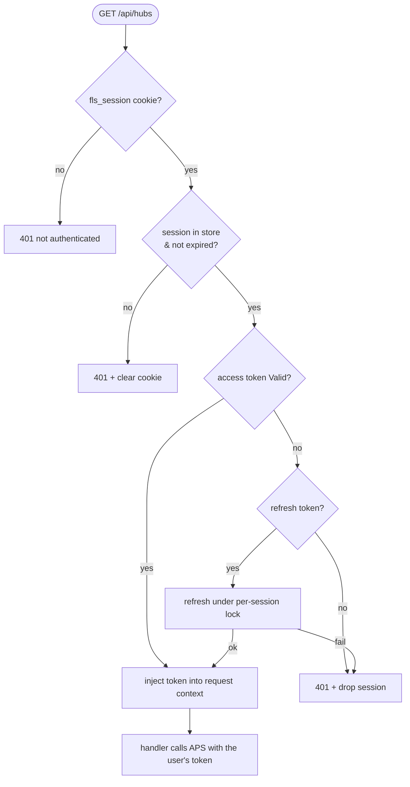
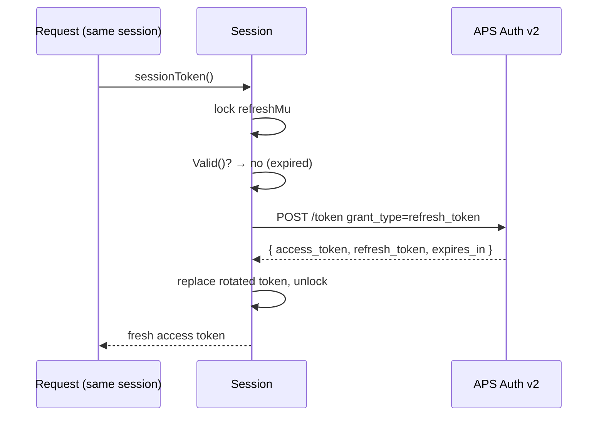

# Authentication

fusionlocalserver logs **each user in with their own Autodesk account** using the
**OAuth 2.0 Authorization Code flow with PKCE** (Proof Key for Code Exchange). It
follows the Backend-For-Frontend (BFF) pattern: the browser holds only an opaque
`HttpOnly` session cookie, while the APS access and refresh tokens live
server-side in an in-memory session store and never reach JavaScript. The server
proxies each user's data calls under that user's own identity.

No client secret is required for a public APS app registration; a confidential
app is supported too (see [Client Authentication Modes](#client-authentication-modes)).

---

## Overview

PKCE prevents authorization-code interception by binding the code exchange to a
random one-time secret that never leaves the server. A separate `state` value
protects the redirect step against CSRF. The parties are the user's browser, the
fusionlocalserver process (which owns both the authorize redirect and the
callback endpoint), and APS.

The server exposes four auth endpoints, all same-origin under `/api/auth`:

| Endpoint | Method | Public | Purpose |
|----------|--------|--------|---------|
| `/api/auth/login` | GET | yes | Start a login: mint PKCE + `state`, 302 to APS authorize |
| `/api/auth/callback` | GET | yes | APS redirect target: validate `state`, exchange code, create session |
| `/api/auth/logout` | POST | yes | Drop the session, clear the cookie |
| `/api/auth/me` | GET | yes | Login-state probe for the SPA (`{authenticated, user?}`) |

Every other `/api/*` data route is gated by `requireAuth` (see below). `/api/meta`
and the SPA assets stay public so the login screen can load.

---

## Login — full PKCE flow

```mermaid
sequenceDiagram
    autonumber
    participant B as User's Browser
    participant App as fusionlocalserver
    participant PS as PendingStore (in-memory)
    participant SS as SessionStore (in-memory)
    participant APS as APS Auth v2

    B->>App: GET /api/auth/login
    App->>App: verifier, challenge = NewPKCE()
    App->>App: state = random 32 bytes
    App->>PS: store {state → verifier, redirect_uri}
    App-->>B: 302 to authorize URL<br/>Set-Cookie: fls_pending=<state>; HttpOnly; SameSite=Lax
    B->>APS: GET /authentication/v2/authorize<br/>?client_id&response_type=code&redirect_uri<br/>&scope=data:read user-profile:read&state<br/>&code_challenge&code_challenge_method=S256
    APS->>B: Autodesk login + consent
    B->>APS: credentials
    APS-->>B: 302 → <origin>/api/auth/callback?code&state
    B->>App: GET /api/auth/callback?code&state (sends fls_pending cookie)
    App->>App: require state == fls_pending cookie
    App->>PS: Take(state) → {verifier, redirect_uri} (single-use)
    App->>APS: POST /authentication/v2/token<br/>grant_type=authorization_code&code&redirect_uri<br/>&code_verifier&client_id
    APS-->>App: { access_token, refresh_token, expires_in }
    App->>APS: GET /userinfo (best-effort, for display)
    App->>SS: Create session {tokens, profile} → random session id
    App-->>B: Set-Cookie: fls_session=<id>; HttpOnly; SameSite=Lax<br/>302 → /
```

**`redirect_uri`.** With `-public-url` set, the callback is fixed to
`<public-url>/api/auth/callback` and a middleware redirects any client that
arrives via a different host to the canonical origin first — so the whole flow
stays same-origin and **only that one callback need be registered on the APS
app**. Without `-public-url` the callback is derived per request from the origin
the browser used (`<scheme>://<host>/api/auth/callback`), which then requires
**every** such origin to be registered (`localhost` ≠ `127.0.0.1`, each LAN
IP/hostname is distinct, and `-tls` makes it `https`). Either way the value
chosen at `/login` is stored in the pending entry and replayed byte-for-byte at
the token exchange (APS rejects a mismatch). See
[`SECURITY-TODO.md`](../SECURITY-TODO.md).

On any failure the callback redirects to `/?auth_error=<reason>`, which the
login screen turns into a readable message.

---

## Authenticated requests — the `requireAuth` gate



`requireAuth` resolves the `fls_session` cookie to a live session, ensures the
access token is valid (refreshing if needed), and places the token in the
request context. Handlers read it via the unchanged `s.token(ctx, …)` helper. A
401 from any data call is what the SPA turns into a login redirect. Data routes
additionally require the session to be locked to a hub (`requireHub` — 409
`hub_not_selected` if no hub is selected, 403 `hub_mismatch` if the request
names a different hub; see [`hubs/STATUS.md`](hubs/STATUS.md)).

---

## Admin whitelist (`admin_users`)

For shared or public deployments, sign-in can be restricted to a whitelist.
Every authenticated session currently has full (admin) powers, so a server
reachable beyond a trusted LAN must not accept arbitrary Autodesk accounts.

**Configuration** — `admin_users` in
`~/.config/fusionlocalserver/config.json`, or the `FLS_ADMIN_USERS` env var
(comma-separated; it overrides the file). Entries are Autodesk OIDC subject
ids (matched exactly) and/or emails (matched case-insensitively — emails
arrive unnormalized from userinfo, sometimes via the legacy `emailId` claim).
The whitelist loads regardless of which layer supplied the APS credentials —
a `config.json` holding only `admin_users` is valid alongside env- or
build-time credentials.

```json
{ "admin_users": ["you@example.com", "teammate@example.com"] }
```

**Semantics**

- **Empty / absent list — open access.** The historical local/LAN posture;
  existing setups are unaffected.
- **Non-empty list — only listed users may hold a session.** Enforced at four
  points, because each is reachable without the others:
  1. the **OAuth callback** — a non-listed user is denied before a session or
     cookie exists, and lands back on the login screen with a
     "not authorized on this server" message (`?auth_error=not_allowed`);
  2. **`requireAuth`** — a live session whose user was since removed from the
     list is deleted and answered 401 (the SPA bounces to login);
  3. **session restore** — persisted sessions of removed users are dropped at
     startup (the restore path never re-enters the callback);
  4. **`/api/auth/me`** — sits outside `requireAuth`, so it repeats the check
     and reports `authenticated: false` for a revoked user.
- **Fail closed.** The userinfo fetch is best-effort; with a whitelist active,
  a login whose profile could not be fetched (empty sub + email) is **denied**
  — otherwise a userinfo outage would bypass the gate.

The list is read at startup only; edit the file (or env) and restart. It is
deliberately **not** editable from the settings UI: there are no admin roles
yet, so a UI editor would let any signed-in user edit the list, and the file
on disk is the recovery path if you lock yourself out.

**Planned relaxation** — a future *restricted role* will let non-listed users
sign in with the admin-only surfaces (settings, logs, backups/restore, data
deletion) gated to whitelisted users; see the future-work note in
[`admin/STATUS.md`](admin/STATUS.md). The `admin_users` name anticipates that
change — relaxing the gate will be additive, with no config migration.

---

## Sessions and token refresh

- **Session store** (`server/session.go`) — an in-memory map keyed by an opaque
  256-bit `crypto/rand` id. Each session carries the user's `TokenData`, a
  display profile, and idle/absolute deadlines (12h idle, 7d absolute). A
  janitor sweeps expired sessions; `Get` also evicts on access.
- **Per-session refresh.** APS rotates the refresh token on every use, so a
  double refresh of one session would invalidate it. Each session has its own
  mutex; the refresh path re-checks `TokenData.Valid()` under the lock, so
  concurrent requests on the same session perform **at most one** refresh and
  the rest observe the freshly-minted token. Unrelated sessions never block each
  other.
- **Persisted, encrypted.** The store is mirrored to
  `~/.config/fusionlocalserver/sessions.enc` (AES-256-GCM, key in `session.key`
  mode 0600), written on create/delete/sweep and after a refresh and reloaded at
  startup — so a restart no longer logs everyone out (expired sessions are
  dropped on load). This is encryption-at-rest of refresh tokens, not OS-keychain
  storage; see [`SECURITY-TODO.md`](../SECURITY-TODO.md).



---

## Cookies

| Cookie | Set at | Lifetime | Attributes |
|--------|--------|----------|------------|
| `fls_pending` | `/api/auth/login` | ~5 min | `HttpOnly`, `SameSite=Lax`, `Path=/` |
| `fls_session` | `/api/auth/callback` | up to the absolute session TTL | `HttpOnly`, `SameSite=Lax`, `Path=/` |

- **`HttpOnly`** — the cookie is never readable from JavaScript; APS tokens stay
  server-side. This is the whole point of the BFF pattern.
- **`SameSite=Lax`** (not `Strict`) — required: the OAuth callback is a top-level
  cross-site navigation from `autodesk.com`, which `Strict` would drop. Lax is
  backed up by `requireSameOrigin` (`server/middleware.go`), which refuses any
  `POST`/`PUT`/`PATCH`/`DELETE` whose `Origin` (or `Referer`, when `Origin` is
  absent) names a different site.
- **`Secure`** — set from `r.TLS`, or from `X-Forwarded-Proto: https` when the
  request came from a **trusted proxy** — loopback, or a `-trusted-proxy` CIDR
  (`server/proxy.go`). An untrusted client sending that header itself is
  ignored, so it cannot force a `Secure` cookie the browser would then refuse to
  send back. Over plain HTTP
  it is therefore **off**, because browsers refuse to store `Secure` cookies on
  `http://`. Run with **`-tls`** (or behind a TLS-terminating proxy) and the same
  binary auto-hardens — the cookie becomes `Secure` and the redirect_uri scheme
  becomes `https`. On plain HTTP a wire sniffer on the LAN could capture a cookie
  and hijack a session, so run on a trusted LAN or enable TLS.

---

## PKCE cryptographic details

| Step | Algorithm | Implementation |
|------|-----------|----------------|
| Verifier generation | `crypto/rand` — 64 bytes | `NewPKCE()` → base64url (no padding) |
| Challenge derivation | SHA-256 → base64url | `verifierToChallenge(verifier)` |
| Challenge method | `S256` | Sent as query parameter to `/authorize` |
| `state` (CSRF) | `crypto/rand` — 32 bytes | Stored server-side + echoed in `fls_pending` |
| Session id | `crypto/rand` — 32 bytes | Generated only on successful login |

---

## Endpoints

| Purpose | URL |
|---------|-----|
| Authorization | `https://developer.api.autodesk.com/authentication/v2/authorize` |
| Token exchange / refresh | `https://developer.api.autodesk.com/authentication/v2/token` |
| User profile (display) | `https://api.userprofile.autodesk.com/userinfo` |
| Redirect receiver | `<public-url>/api/auth/callback` when `-public-url` is set (one registration), else `<server-origin>/api/auth/callback` derived per request; must be registered on the APS app |

**Required scopes:** `data:read user-profile:read`

---

## Client authentication modes

APS supports both public and confidential app registrations.

| Mode | How the client is identified | When to use |
|------|------------------------------|-------------|
| **Public client** (default) | `client_id` in the POST form body | No server-side secret storage |
| **Confidential client** | HTTP Basic Auth (`client_id:client_secret`) | When you provision a client secret |

The server detects which to use automatically:
- If `APS_CLIENT_SECRET` / `client_secret` is configured → confidential (Basic Auth, no form `client_id`).
- Otherwise → public client (form body only).

---

## Security notes

- The `code_verifier` and `state` are generated fresh per login and never logged.
- The session id is minted only **after** a successful code exchange, so a login
  cannot fixate a session id.
- Pending logins are single-use and short-lived (~5 min); a replayed callback
  finds no entry and is rejected, and APS also rejects a reused authorization code.
- Verbose tracing (`-v`) logs API request/response bodies but never tokens —
  `Authorization` headers aren't traced, `signedUrl` values are redacted, and
  the per-request log line redacts the OAuth `code`/`state` (and any
  token-shaped query parameter) via `redactQuery`.
- The pre-session auth routes are rate limited per client IP (`perIP` in
  `server/routes.go`): login/callback/logout at a 10 burst refilling one per
  2 s, `/api/auth/me` far more generously. Behind a reverse proxy the key comes
  from `X-Forwarded-For`, which is only read from a trusted peer — so one user
  cannot spend another's budget by forging the header.
- Tokens never reach the browser or any plaintext file: they live in server
  memory and are persisted only encrypted at rest (`sessions.enc`, AES-256-GCM,
  key in `session.key` mode 0600 — see [Sessions and token refresh](#sessions-and-token-refresh)).

TLS/`Secure` cookie (`-tls` on by default), encrypted session persistence, log
redaction, the trusted-proxy boundary, the same-origin CSRF backstop and the
auth rate limiter have all shipped; [`SECURITY-TODO.md`](../SECURITY-TODO.md)
tracks the history and the two remaining (operator/platform) items: OS-keychain
key storage and APS callback registration.
